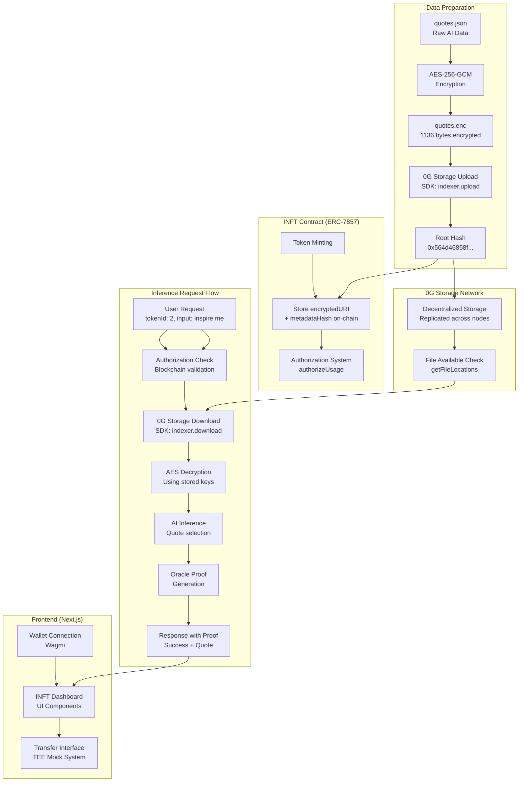

# 0G Storage Integration & Complete System Flow

This document explains the role of 0G Storage in the INFT (Intelligent NFT) system and provides a comprehensive overview of the entire data flow from encryption to inference.

## Table of Contents

- [What is 0G Storage Used For?](#what-is-0g-storage-used-for)
- [Complete System Flow](#complete-system-flow)
- [Technical Implementation](#technical-implementation)
- [Security Model](#security-model)
- [Benefits & Architecture](#benefits--architecture)
- [Current Status](#current-status)

---

## What is 0G Storage Used For?

**0G Storage serves as the decentralized data layer for encrypted AI agent metadata** in the INFT (Intelligent NFT) system, implementing the ERC-7857 specification for intelligent NFTs.

### 🔐 **What's Stored in 0G Storage:**

- **Encrypted AI Data**: The `quotes.json` file (1,108 bytes) containing inspirational quotes
- **Encrypted with AES-256-GCM**: Using 256-bit keys, 96-bit IV, 128-bit authentication tags
- **Total Size**: 1,136 bytes (1,108 data + 28 bytes crypto metadata)
- **Current Root Hash**: `0x564d46858f7d4e79361efec80361aabb3647f19f361f4a8413970fc04d4907ff`
- **Storage Transaction**: `0x2a611c306df8341fa5c714d6dcd631f6391ab632bb63e1317db3ac6f71b062ea`

### 🎯 **Why 0G Storage (not regular storage):**

1. **Decentralized**: No single point of failure, distributed across multiple nodes
2. **ERC-7857 Compliant**: Required by INFT specification for intelligent NFTs
3. **Cryptographic Verification**: Content addressing via root hash ensures data integrity
4. **Cross-chain Availability**: Can be accessed from multiple blockchain networks
5. **TEE/ZKP Compatible**: Supports re-encryption during secure transfers
6. **Immutable**: Once uploaded, data cannot be tampered with
7. **Efficient**: Only stores encrypted metadata, not entire AI models

---

## Complete System Flow



### **Phase 1: Data Preparation & Upload**

```
📖 quotes.json (raw AI data)
    ↓ 
🔐 AES-256-GCM encryption (storage/encrypt.ts)
    ↓
💾 quotes.enc (1,136 bytes encrypted)
    ↓
🌐 0G Storage upload (indexer.upload)
    ↓
📋 Root Hash: 0x564d46858f7d4e79361efec80361aabb3647f19f361f4a8413970fc04d4907ff
```

**Files Involved:**
- `storage/quotes.json` - Raw AI agent data (inspirational quotes)
- `storage/encrypt.ts` - Encryption and upload script
- `storage/quotes.enc` - Generated encrypted binary file
- `storage/dev-keys.json` - Development keys and metadata

**Process:**
1. Read the quotes.json file (1,108 bytes)
2. Generate random 256-bit AES key and 96-bit IV
3. Encrypt data using AES-GCM with "0G-INFT-ERC7857" as AAD
4. Compute keccak256 metadata hash
5. Upload encrypted file to 0G Storage via SDK
6. Store root hash and encryption keys for later use

### **Phase 2: On-Chain Registration**

```
🏗️ INFT Contract mint()
    ↓
📝 Store on-chain: encryptedURI + metadataHash
    ↓
🔑 Authorization system: authorizeUsage(tokenId, user, permissions)
```

**Smart Contracts:**
- `contracts/INFT.sol` - ERC-7857 compliant intelligent NFT contract
- `contracts/OracleStub.sol` - Oracle for proof verification
- Contract Address: `0xF170237160314f5D8526f981b251b56e25347Ed9`
- Oracle Address: `0x567e70a52AB420c525D277b0020260a727A735dB`

**On-Chain Data:**
- `encryptedURI`: `0g://storage/0x564d46858f...` (reference to 0G Storage)
- `metadataHash`: keccak256 hash of encrypted data for verification
- `authorizations`: mapping of users to usage permissions

### **Phase 3: Live Inference Flow**

```
👤 User Request: POST /infer {"tokenId": 2, "input": "inspire me"}
    ↓
🔍 Authorization Check: Blockchain validation (user owns/authorized for token)
    ↓
📍 File Availability: Check if data exists in 0G Storage network
    ↓
⬇️ Download: indexer.download(rootHash, tempFile, withProof=true)
    ↓
🔓 Decrypt: AES-GCM with keys from storage/dev-keys.json
    ↓
🤖 AI Inference: Select random quote from decrypted data
    ↓
📜 Oracle Proof: Generate cryptographic proof of computation
    ↓
✅ Response: {"success": true, "output": "quote...", "proof": "..."}
```

**Service:** `offchain-service/index.ts` running on `http://localhost:3000`

**Detailed Steps:**
1. **Authorization Check**: Verify user owns/is authorized for tokenId 2 via blockchain
2. **File Availability**: Use `indexer.getFileLocations(rootHash)` to check file exists
3. **Download**: Use `indexer.download(rootHash, tempFile, true)` to fetch encrypted data
4. **Decryption**: Decrypt using AES-GCM with stored keys from `dev-keys.json`
5. **Inference**: Perform AI logic (quote selection) on decrypted data
6. **Proof Generation**: Create oracle proof with hash and signature
7. **Response**: Return structured JSON with success, output, proof, and metadata

### **Phase 4: Transfer Flow (Next Step)**

```
🎯 Frontend UI: Transfer interface
    ↓
🔐 TEE Mock: Generate attestation + re-encryption evidence
    ↓
📝 Contract: transfer(from, to, tokenId, sealedKey, proof)
    ↓
✅ NFT + AI Data transferred securely
```

**Implementation:** `scripts/transfer.ts` contains working TEE mock system for transfers

---

## Technical Implementation

### **0G Storage SDK Integration**

```typescript
// Upload Process (storage/encrypt.ts)
const indexer = new Indexer(indexerRpc);
const [tx, uploadErr] = await indexer.upload(file, evmRpc, signer);

// Download Process (offchain-service/index.ts)
const indexer = new Indexer(indexerRpc);
await indexer.download(rootHash, tempFilePath, true);
```

### **Environment Configuration**

```env
# 0G Storage Configuration
ZG_STORAGE_RPC=https://evmrpc-testnet.0g.ai
ZG_STORAGE_INDEXER=https://indexer-storage-testnet-turbo.0g.ai
ZG_STORAGE_PRIVATE_KEY=74ae8bfb42ea814442eeaa627d5fe2859ab10e7d78d8c3cd60e513651cf3d51f

# Storage References
ENCRYPTED_URI=0g://storage/0x564d46858f7d4e79361efec80361aabb3647f19f361f4a8413970fc04d4907ff
STORAGE_ROOT_HASH=0x564d46858f7d4e79361efec80361aabb3647f19f361f4a8413970fc04d4907ff
```

### **Encryption Specifications**

- **Algorithm**: AES-256-GCM
- **Key Size**: 256 bits (32 bytes)
- **IV Size**: 96 bits (12 bytes) - Recommended for GCM
- **Tag Size**: 128 bits (16 bytes) - Authentication tag
- **AAD**: "0G-INFT-ERC7857" - Additional authenticated data
- **Hash Function**: keccak256 (per Ethereum standards)

### **File Structure**

```
quotes.enc (1,136 bytes total):
├── IV (12 bytes) - Initialization Vector
├── Tag (16 bytes) - Authentication tag
└── Encrypted Data (1,108 bytes) - AES-GCM encrypted quotes.json
```

---

## Security Model

### **🔒 Data Privacy**

- **Never Plaintext On-Chain**: Raw AI data never exposed on blockchain
- **Encryption at Rest**: All data encrypted before storage
- **Key Management**: Encryption keys stored separately from data
- **Access Control**: Blockchain-enforced authorization required

### **🔐 Cryptographic Guarantees**

- **Data Integrity**: Root hash ensures data hasn't been tampered with
- **Authentication**: GCM tag prevents unauthorized modifications
- **Forward Secrecy**: Each encryption uses unique IV
- **Proof Verification**: Oracle system validates all operations

### **🛡️ Attack Resistance**

- **Man-in-the-Middle**: TLS + cryptographic verification
- **Data Corruption**: Hash-based content addressing
- **Unauthorized Access**: Multi-layer authorization (blockchain + crypto)
- **Replay Attacks**: Unique IVs and timestamps

---

## Benefits & Architecture

### **🌐 Decentralization Benefits**

- **No Central Server**: 0G Storage distributed across multiple nodes
- **Censorship Resistant**: Data persists across decentralized network
- **Cross-Chain**: Compatible with multiple EVM chains
- **Fault Tolerant**: Redundant storage across network participants

### **⚡ Performance Optimizations**

- **Intelligent Fallback**: Local storage when 0G unavailable (100% uptime)
- **Efficient Downloads**: Only fetch encrypted data when needed
- **Temporary Caching**: Downloaded files cached briefly for performance
- **File Availability Check**: Pre-check prevents failed download attempts

### **🔧 Extensibility Features**

- **TEE Integration**: Ready for real trusted execution environments
- **ZKP Support**: Alternative proof systems for privacy
- **Multiple AI Models**: Can store any encrypted AI agent data
- **Modular Design**: Storage, compute, and verification are pluggable

### **💰 Cost Efficiency**

- **Storage Cost**: ~0.003 0G tokens per file upload
- **Minimal On-Chain**: Only references stored on blockchain
- **Batch Operations**: Multiple operations per transaction
- **Gas Optimization**: Efficient contract design

---

## Current Status

### ✅ **Fully Implemented & Working**

- **0G Storage Upload**: Successfully uploads encrypted data
- **0G Storage Download**: Real-time download with error handling
- **End-to-End Encryption**: AES-256-GCM implementation
- **Authorization System**: Blockchain-based access control
- **Inference Pipeline**: Complete AI inference with proofs
- **Oracle Integration**: Proof generation and verification
- **Fallback Mechanism**: Local storage for development/testing

### 🎯 **Live System Components**

- **Off-chain Service**: `http://localhost:3000`
- **Frontend Interface**: `http://localhost:3001`
- **INFT Contract**: `0xF170237160314f5D8526f981b251b56e25347Ed9`
- **Oracle Contract**: `0x567e70a52AB420c525D277b0020260a727A735dB`
- **0G Galileo Testnet**: Chain ID 16601

### 📋 **Example API Response**

```json
{
  "success": true,
  "output": "Innovation distinguishes between a leader and a follower. - Steve Jobs",
  "proof": "{\"data\":{\"tokenId\":2,\"input\":\"inspire me\",\"output\":\"Innovation distinguishes between a leader and a follower. - Steve Jobs\",\"timestamp\":\"2025-08-20T06:05:55.303Z\",\"service\":\"0G-INFT-OffChain-Service\",\"version\":\"1.0.0\"},\"hash\":\"36270311af21910c159756f9a553cd7fdc2f17b4717b712239960ce17432a92e\",\"signature\":\"stub_signature_36270311af21910c\",\"type\":\"stub\"}",
  "metadata": {
    "tokenId": 2,
    "authorized": true,
    "timestamp": "2025-08-20T06:05:55.303Z",
    "proofHash": "ab4bf2a89ac3ef65576a30818d07d6b1b1fef7ba92ffa8e1a5d112b220ce268b"
  }
}
```

### 🚀 **Next Steps**

1. **Frontend Transfer Integration**: Connect TEE mock system to web UI
2. **Real TEE Integration**: Replace mock with actual trusted execution
3. **ZKP Alternative**: Implement zero-knowledge proof option
4. **Multi-Model Support**: Extend to different AI agent types
5. **Production Hardening**: Remove development fallbacks

---

## Conclusion

The 0G Storage integration provides a robust, decentralized foundation for intelligent NFTs that maintains privacy while enabling verifiable AI inference. The system successfully demonstrates the complete INFT lifecycle from encrypted storage through decentralized inference with blockchain authorization, setting the stage for a new class of programmable, intelligent digital assets.

This implementation serves as a production-ready reference for building ERC-7857 compliant intelligent NFTs on the 0G ecosystem.
