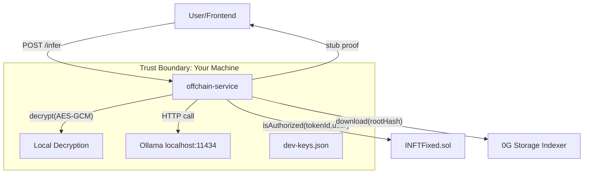
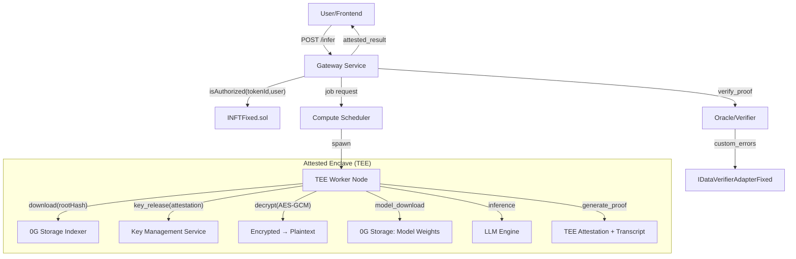
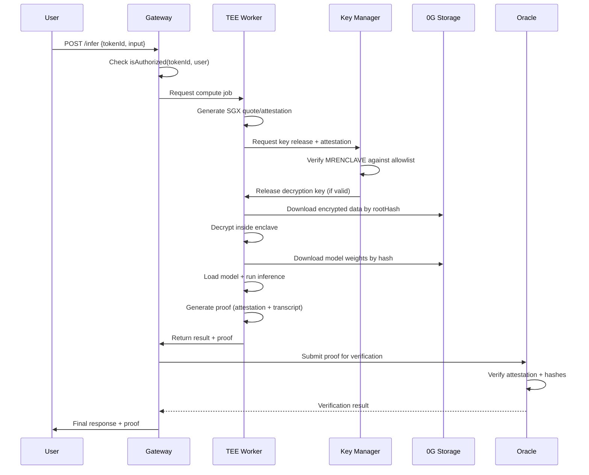

## 0G INFT Vision vs Current Implementation

This document explains how 0G's INFT (Intelligent NFT) is designed to work in production versus the current development implementation, focusing on verifiable off‑chain AI inference, TEE/ZK attestation, and the trust model.

---

## Current Dev Implementation (What We Have)

### Architecture Overview

### Current Flow
1. **Authorization**: `INFTFixed.isAuthorized(tokenId, user)` on‑chain (ERC‑7857).
2. **Data Retrieval**: Download encrypted payload from 0G Storage via `Indexer.download(rootHash, tempFile, true)`.
3. **Decryption**: AES‑GCM decrypt using keys from `storage/dev-keys.json` (plaintext on disk).
4. **Inference**: Call local Ollama (`http://localhost:11434/api/generate`) with bounded context from decrypted quotes.
5. **Proof**: Generate stub proof with hashes (`prompt_hash`, `context_hash`, `completion_hash`, `model_id`).
6. **Response**: Return result + metadata to frontend.

### Trust Model (Dev)
- **Single tenant**: Everything runs on your machine.
- **Key storage**: Plaintext in `dev-keys.json`.
- **Compute**: Unattested local LLM.
- **Verification**: Stub proof (hashes only, no cryptographic attestation).
- **Fallbacks**: Local file (`storage/quotes.enc`) if 0G Storage unavailable.

---

## 0G INFT Production Vision (What It Should Be)

### Architecture Overview

### Production Flow
1. **Authorization**: Same on‑chain check via `INFTFixed.isAuthorized(tokenId, user)`.
2. **Job Scheduling**: Gateway requests compute from a TEE worker pool.
3. **Attestation**: TEE worker generates attestation (SGX quote, TDX report, etc.).
4. **Key Release**: Key Management Service validates attestation and releases decryption key to the enclave only.
5. **Secure Download**: Inside TEE, download encrypted data from 0G Storage by `rootHash`.
6. **Secure Decryption**: Decrypt inside the enclave using the released key.
7. **Model Loading**: Download model weights from 0G Storage (pinned by hash); verify integrity.
8. **Attested Inference**: Run LLM inside TEE; all computation is measured/logged.
9. **Proof Generation**: Create cryptographic proof including:
   - Enclave measurement (MRENCLAVE/MRSIGNER)
   - Dataset hash and model hash
   - Prompt, context, and output hashes
   - Attestation signature
10. **Verification**: Oracle verifies the proof on‑chain or off‑chain, then posts result.
11. **Error Handling**: `IDataVerifierAdapterFixed` surfaces custom errors if verification fails.

### Trust Model (Production)
- **Multi‑tenant**: TEE workers serve multiple users; isolation via hardware.
- **Key storage**: Hardware‑secured key release based on attestation + policy.
- **Compute**: Attested execution inside SGX/TDX/etc.
- **Verification**: Cryptographic proof of correct execution.
- **No fallbacks**: All data and models come from 0G Storage with integrity checks.

---

## Key Differences: Dev vs Production

| Aspect | Current Dev | 0G Production Vision |
|--------|-------------|---------------------|
| **Compute Environment** | Local Ollama (unattested) | TEE worker nodes (SGX/TDX) |
| **Key Management** | Plaintext `dev-keys.json` | Hardware key release via attestation |
| **Data Source** | 0G Storage + local fallback | 0G Storage only (integrity verified) |
| **Model Source** | Local Ollama models | 0G Storage (model weights by hash) |
| **Proof System** | Stub (hashes only) | TEE attestation + transcript commitment |
| **Verification** | None (trust the service) | On‑chain oracle verification |
| **Error Handling** | HTTP status codes | Custom errors via `IDataVerifierAdapterFixed` |
| **Trust Boundary** | Your entire machine | Hardware‑enforced enclave only |
| **Scalability** | Single instance | Distributed TEE worker pool |

---

## Security Properties: Dev vs Production

### Current Dev Security
- ✅ On‑chain authorization via ERC‑7857
- ✅ AES‑GCM encryption for data at rest
- ✅ HTTPS for transport (when deployed)
- ❌ Keys stored in plaintext on disk
- ❌ Unattested compute (can be tampered with)
- ❌ No proof of correct execution
- ❌ Single point of failure

### Production Security (0G Vision)
- ✅ On‑chain authorization via ERC‑7857
- ✅ AES‑GCM encryption for data at rest
- ✅ HTTPS + mTLS for transport
- ✅ Hardware‑secured key release
- ✅ Attested compute (tamper‑evident)
- ✅ Cryptographic proof of execution
- ✅ Distributed, fault‑tolerant
- ✅ On‑chain verification of proofs

---

## Migration Path: Dev → Production

### Phase 1: Current LLM Integration (Dev)
- Replace random quote with Ollama LLM
- Add proof stub with transcript hashes
- Keep `dev-keys.json` and local compute
- **Status**: Covered by `docs/LLM.md` and `docs/LLMplan.md`

### Phase 2: Containerized Deployment
- Docker‑compose with Ollama + offchain‑service
- External secrets management (HashiCorp Vault, AWS Secrets Manager)
- Private networking between components
- Health checks and monitoring

### Phase 3: TEE Integration (Research)
- Survey TEE options: Intel SGX, AMD SEV, ARM TrustZone, Confidential Containers
- Design key release protocol (attestation → key manager → enclave)
- Prototype inference inside SGX enclave
- Define attestation verification logic for oracle

### Phase 4: 0G Storage for Models
- Upload model weights (GGUF) to 0G Storage
- Pin by hash in configuration
- Download and verify inside TEE
- Remove local model dependencies

### Phase 5: Production Oracle
- Replace `OracleStub` with TEE attestation verifier
- Implement custom error mapping in `IDataVerifierAdapterFixed`
- Add on‑chain proof verification and result posting
- Gas optimization for proof verification

### Phase 6: ZK Alternative (Future)
- Research ZK‑SNARKs for LLM inference
- Compare TEE vs ZK trade‑offs (performance, trust assumptions)
- Prototype ZK proof generation for model execution
- Integrate with 0G Oracle patterns

---

## TEE Implementation Details

### Attestation Flow

### Key Management Service (KMS)
- **Policy**: Only release keys to enclaves with specific MRENCLAVE + on‑chain authorization.
- **Attestation**: Verify SGX quote signature against Intel's attestation service.
- **Key Derivation**: Per‑tokenId keys derived from master secret.
- **Audit**: Log all key releases with attestation details.

### TEE Worker Requirements
- **Hardware**: Intel SGX‑enabled CPUs or AMD SEV‑SNP.
- **Software**: Gramine, Occlum, or similar TEE runtime.
- **Networking**: Secure channels to 0G Storage and KMS.
- **Storage**: Encrypted temporary files; no persistent secrets.

---

## ZK Alternative (Research Direction)

### ZK‑SNARK for LLM Inference
- **Circuit**: Prove correct execution of quantized transformer layers.
- **Inputs**: Model weights hash, input tokens, randomness.
- **Outputs**: Generated tokens + proof of computation.
- **Challenges**: Circuit size, proving time, memory constraints.

### ZK vs TEE Trade‑offs
| Aspect | TEE (SGX/TDX) | ZK‑SNARKs |
|--------|---------------|-----------|
| **Trust** | Hardware manufacturer | Math/cryptography |
| **Performance** | Native speed | 10‑1000x slower |
| **Flexibility** | Any code | Circuit‑constrained |
| **Setup** | Hardware required | Trusted setup (some schemes) |
| **Verification** | Attestation service | On‑chain verifier |
| **Privacy** | Input/output hidden | Zero‑knowledge proofs |

---

## Current Contracts and Future Changes

### Existing Contracts (No Changes Needed)
- **INFTFixed.sol**: ERC‑7857 authorization, transfer, metadata
- **IDataVerifierAdapterFixed.sol**: Bubbles revert data, custom errors
- **OracleStub.sol**: Placeholder for proof verification

### Future Contract Enhancements
- **Oracle Upgrade**: Replace stub with TEE/ZK proof verifier
- **Gas Optimization**: Batch verification, precompiles for common operations
- **Result Storage**: Optional on‑chain caching of verified results
- **Slashing**: Penalize workers for invalid proofs (if using staked model)

---

## Operational Considerations

### Deployment Topology (Production)