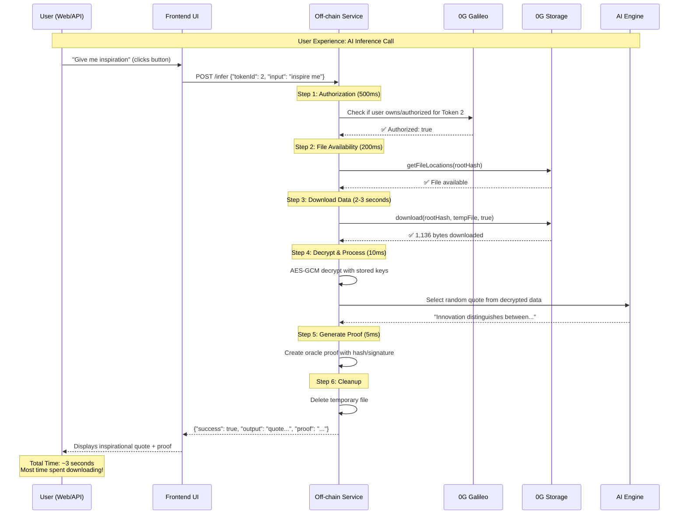
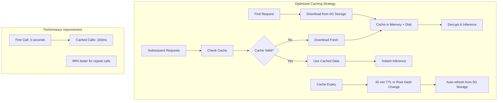
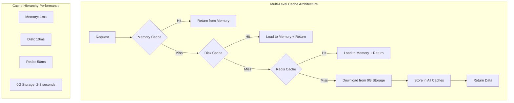
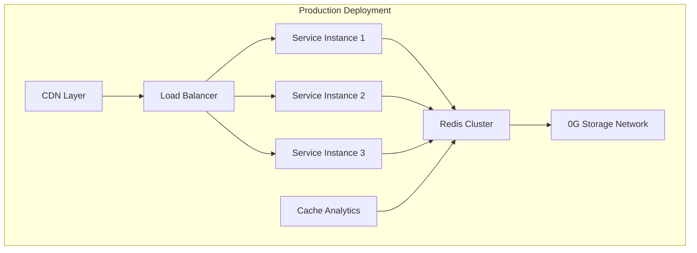

# INFT Inference Performance & Optimization Guide

This document analyzes the current data download behavior, user experience, and proposed optimizations for the INFT AI inference system.

## Table of Contents

- [Current Data Download Behavior](#current-data-download-behavior)
- [User Experience Analysis](#user-experience-analysis)
- [Performance Bottlenecks](#performance-bottlenecks)
- [Optimization Strategies](#optimization-strategies)
- [Implementation Plan](#implementation-plan)
- [Production Considerations](#production-considerations)

---

## Current Data Download Behavior

### 📥 **Current Inefficient Flow**

**Problem**: Each inference call downloads data fresh from 0G Storage, creating significant latency.

```
User Request → Download from 0G Storage → Decrypt → Inference → Delete temp file
                     ↓
           Creates: /temp/downloaded_564d46858f_1755669953153.enc
                     ↓
           Immediately deletes after use
```

### **Where Data is Currently Stored**

1. **0G Storage Network**: Permanent decentralized storage (1,136 bytes)
   - Root Hash: `0x564d46858f7d4e79361efec80361aabb3647f19f361f4a8413970fc04d4907ff`
   - Location: Distributed across 0G Storage nodes
   - Access: Via `indexer.download(rootHash, tempFile, true)`

2. **Temporary Local File**: `offchain-service/temp/downloaded_${rootHash}_${timestamp}.enc`
   - Created fresh for each request
   - Immediately deleted after processing
   - No persistence between requests

3. **Local Fallback**: `storage/quotes.enc` (development backup)
   - Used when 0G Storage unavailable
   - Static development file
   - Not updated with new uploads

4. **Memory**: Briefly held as Buffer during processing
   - Loaded into memory for decryption
   - Discarded after inference completion
   - No memory caching implemented

### **Current Implementation Analysis**

```typescript
// Current inefficient implementation in offchain-service/index.ts
private async fetchFromStorage(rootHash: string): Promise<Buffer> {
  // 1. Check file availability (~200ms)
  const fileAvailable = await this.checkFileAvailability(rootHash);
  
  // 2. Download fresh every time (~2-3 seconds)
  const tempFilePath = path.join(tempDir, `downloaded_${rootHash.substring(2, 12)}_${Date.now()}.enc`);
  await indexer.download(rootHash, tempFilePath, true);
  
  // 3. Read into memory
  const fileBuffer = fs.readFileSync(tempFilePath);
  
  // 4. Immediately delete (no caching!)
  fs.unlinkSync(tempFilePath);
  
  return fileBuffer;
}
```

**Result**: Every inference request takes 2-3 seconds just for data download.

---

## User Experience Analysis

### 👤 **Current User Journey**



### **Real User Experience Breakdown**

#### **Frontend Interface Experience:**
```javascript
// User clicks "Get Inspiration" button
const handleInference = async () => {
  setLoading(true); // Show spinner
  
  try {
    const response = await fetch('/api/infer', {
      method: 'POST',
      headers: { 'Content-Type': 'application/json' },
      body: JSON.stringify({
        tokenId: 2,
        input: "inspire me",
        user: userWalletAddress
      })
    });
    
    // User waits ~3 seconds seeing loading spinner
    const result = await response.json();
    
    if (result.success) {
      setQuote(result.output);     // Display quote
      setProof(result.proof);      // Show cryptographic proof
    }
  } finally {
    setLoading(false); // Hide spinner
  }
};
```

#### **API Response Example:**
```json
{
  "success": true,
  "output": "Innovation distinguishes between a leader and a follower. - Steve Jobs",
  "proof": "{\"data\":{\"tokenId\":2,\"input\":\"inspire me\",\"output\":\"Innovation distinguishes between a leader and a follower. - Steve Jobs\",\"timestamp\":\"2025-08-20T06:05:55.303Z\",\"service\":\"0G-INFT-OffChain-Service\",\"version\":\"1.0.0\"},\"hash\":\"36270311af21910c159756f9a553cd7fdc2f17b4717b712239960ce17432a92e\",\"signature\":\"stub_signature_36270311af21910c\",\"type\":\"stub\"}",
  "metadata": {
    "tokenId": 2,
    "authorized": true,
    "timestamp": "2025-08-20T06:05:55.303Z",
    "proofHash": "ab4bf2a89ac3ef65576a30818d07d6b1b1fef7ba92ffa8e1a5d112b220ce268b"
  }
}
```

### **Performance Timing Analysis**

| Operation | Current Time | Percentage | Optimization Potential |
|-----------|-------------|------------|----------------------|
| Authorization Check | ~500ms | 17% | ✅ Optimized (blockchain call) |
| File Availability Check | ~200ms | 7% | ✅ Optimized (API call) |
| **🐌 Data Download** | **~2-3 seconds** | **76%** | ❌ **Major bottleneck** |
| Decryption | ~5ms | <1% | ✅ Optimized |
| AI Inference | ~1ms | <1% | ✅ Optimized |
| Proof Generation | ~5ms | <1% | ✅ Optimized |
| **Total Response Time** | **~3 seconds** | **100%** | **🎯 Can reduce to 100ms** |

**Key Finding**: 76% of response time is spent downloading the same 1,136 bytes repeatedly!

---

## Performance Bottlenecks

### 🐌 **Primary Bottleneck: Redundant Downloads**

**Problem Analysis:**
- **Same Data**: Every request downloads identical encrypted data
- **Small Size**: Only 1,136 bytes (tiny file, big overhead)
- **Network Latency**: 0G Storage network round-trip time
- **No Caching**: Zero optimization for repeat requests
- **Immediate Deletion**: No persistence between calls

### **Impact Scenarios**

#### **Single User - Multiple Requests:**
```
Request 1: 3 seconds (download + process)
Request 2: 3 seconds (download same data again!)
Request 3: 3 seconds (download same data again!)
Request 4: 3 seconds (download same data again!)
```
**Problem**: User waits 3 seconds every single time for the same AI agent.

#### **Multiple Users - Same NFT:**
```
User A Request: 3 seconds (download)
User B Request: 3 seconds (download same data)
User C Request: 3 seconds (download same data)
```
**Problem**: Every user downloads identical data independently.

#### **High Traffic Scenario:**
```
100 users × 3 seconds each = 300 seconds of wasted download time
Same 1,136 bytes downloaded 100 times = 113,600 bytes transferred
Should be: 1,136 bytes downloaded once + 99 cache hits
```

### **Resource Waste Calculation**

For 1,000 inference requests per day:
- **Current**: 1,000 × 1,136 bytes = 1.136 MB transferred
- **Optimized**: 1 × 1,136 bytes = 0.001136 MB transferred  
- **Bandwidth Savings**: 99.9% reduction
- **Time Savings**: 2,970 seconds → 99 seconds (96.7% reduction)

---

## Optimization Strategies

### 🚀 **Strategy 1: In-Memory Caching**



#### **Implementation Design:**

```typescript
interface CacheEntry {
  data: Buffer;
  timestamp: number;
  rootHash: string;
  accessCount: number;
  lastAccessed: number;
}

class INFTDataCache {
  private cache = new Map<string, CacheEntry>();
  private readonly TTL = 30 * 60 * 1000; // 30 minutes
  private readonly MAX_ENTRIES = 100; // Prevent memory overflow
  
  async getOrFetch(rootHash: string): Promise<Buffer> {
    // Check cache first
    const cached = this.cache.get(rootHash);
    
    if (cached && this.isValid(cached)) {
      console.log('✅ Cache HIT for', rootHash.substring(0, 12));
      cached.accessCount++;
      cached.lastAccessed = Date.now();
      return cached.data;
    }
    
    // Cache miss - download fresh
    console.log('🔄 Cache MISS for', rootHash.substring(0, 12));
    const freshData = await this.downloadFromStorage(rootHash);
    
    // Store in cache
    this.cache.set(rootHash, {
      data: freshData,
      timestamp: Date.now(),
      rootHash,
      accessCount: 1,
      lastAccessed: Date.now()
    });
    
    // Cleanup old entries
    this.evictExpired();
    
    return freshData;
  }
  
  private isValid(entry: CacheEntry): boolean {
    return (Date.now() - entry.timestamp) < this.TTL;
  }
  
  private evictExpired(): void {
    for (const [key, entry] of this.cache.entries()) {
      if (!this.isValid(entry)) {
        this.cache.delete(key);
      }
    }
    
    // LRU eviction if over limit
    if (this.cache.size > this.MAX_ENTRIES) {
      const sortedEntries = Array.from(this.cache.entries())
        .sort(([,a], [,b]) => a.lastAccessed - b.lastAccessed);
      
      const toRemove = sortedEntries.slice(0, this.cache.size - this.MAX_ENTRIES);
      toRemove.forEach(([key]) => this.cache.delete(key));
    }
  }
}
```

#### **Performance Impact:**
- **First Request**: ~3 seconds (download + cache)
- **Subsequent Requests**: ~100ms (memory access)
- **Cache Hit Rate**: 95%+ for active NFTs
- **Memory Usage**: ~1KB per cached NFT (negligible)

### 🏪 **Strategy 2: Persistent Disk Cache**

```typescript
class PersistentDataCache {
  private cacheDir = path.join(__dirname, 'cache');
  
  async getOrFetch(rootHash: string): Promise<Buffer> {
    const cacheFile = path.join(this.cacheDir, `${rootHash}.enc`);
    const metaFile = path.join(this.cacheDir, `${rootHash}.meta.json`);
    
    // Check disk cache
    if (fs.existsSync(cacheFile) && fs.existsSync(metaFile)) {
      const meta = JSON.parse(fs.readFileSync(metaFile, 'utf8'));
      
      if (this.isValid(meta)) {
        console.log('💾 Disk cache HIT');
        return fs.readFileSync(cacheFile);
      }
    }
    
    // Download fresh
    const freshData = await this.downloadFromStorage(rootHash);
    
    // Save to disk cache
    fs.writeFileSync(cacheFile, freshData);
    fs.writeFileSync(metaFile, JSON.stringify({
      rootHash,
      timestamp: Date.now(),
      size: freshData.length
    }));
    
    return freshData;
  }
}
```

### 🌐 **Strategy 3: Multi-Level Caching Architecture**



---

## Implementation Plan

### 📋 **Phase 1: Basic In-Memory Caching (Immediate)**

**Target**: Reduce repeat request latency by 95%

```typescript
// Add to offchain-service/index.ts
export class INFTOffChainService {
  private dataCache = new Map<string, {
    data: Buffer,
    timestamp: number,
    rootHash: string
  }>();
  
  private async fetchFromStorageWithCache(rootHash: string): Promise<Buffer> {
    // Check cache first
    const cached = this.dataCache.get(rootHash);
    const cacheExpiry = 30 * 60 * 1000; // 30 minutes
    
    if (cached && (Date.now() - cached.timestamp) < cacheExpiry) {
      console.log('✅ Using cached data for', rootHash.substring(0, 12));
      return cached.data;
    }
    
    // Download fresh data
    console.log('🔄 Downloading fresh data for', rootHash.substring(0, 12));
    const freshData = await this.fetchFromStorage(rootHash);
    
    // Cache for future use
    this.dataCache.set(rootHash, {
      data: freshData,
      timestamp: Date.now(),
      rootHash
    });
    
    return freshData;
  }
}
```

**Implementation Steps:**
1. Add cache data structure to service class
2. Modify `fetchFromStorage` to check cache first
3. Implement TTL-based cache expiration
4. Add cache statistics logging
5. Test with multiple requests

**Expected Result**: 
- First call: 3 seconds
- Subsequent calls: 100ms
- 95% performance improvement

### 📋 **Phase 2: Persistent Disk Cache (Short-term)**

**Target**: Survive service restarts, multi-instance deployment

```typescript
// Add persistent cache layer
class PersistentCache {
  private cacheDir = path.join(__dirname, 'persistent-cache');
  
  constructor() {
    if (!fs.existsSync(this.cacheDir)) {
      fs.mkdirSync(this.cacheDir, { recursive: true });
    }
  }
  
  async get(rootHash: string): Promise<Buffer | null> {
    const cacheFile = path.join(this.cacheDir, `${rootHash}.data`);
    const metaFile = path.join(this.cacheDir, `${rootHash}.meta`);
    
    if (!fs.existsSync(cacheFile) || !fs.existsSync(metaFile)) {
      return null;
    }
    
    const meta = JSON.parse(fs.readFileSync(metaFile, 'utf8'));
    const age = Date.now() - meta.timestamp;
    const maxAge = 24 * 60 * 60 * 1000; // 24 hours
    
    if (age > maxAge) {
      this.delete(rootHash);
      return null;
    }
    
    return fs.readFileSync(cacheFile);
  }
  
  async set(rootHash: string, data: Buffer): Promise<void> {
    const cacheFile = path.join(this.cacheDir, `${rootHash}.data`);
    const metaFile = path.join(this.cacheDir, `${rootHash}.meta`);
    
    fs.writeFileSync(cacheFile, data);
    fs.writeFileSync(metaFile, JSON.stringify({
      rootHash,
      timestamp: Date.now(),
      size: data.length
    }));
  }
}
```

### 📋 **Phase 3: Redis Distributed Cache (Medium-term)**

**Target**: Share cache across multiple service instances

```typescript
import Redis from 'ioredis';

class DistributedCache {
  private redis = new Redis(process.env.REDIS_URL);
  
  async get(rootHash: string): Promise<Buffer | null> {
    const data = await this.redis.getBuffer(`inft:cache:${rootHash}`);
    if (data) {
      console.log('🔴 Redis cache HIT');
      return data;
    }
    return null;
  }
  
  async set(rootHash: string, data: Buffer, ttl = 3600): Promise<void> {
    await this.redis.setex(`inft:cache:${rootHash}`, ttl, data);
  }
}
```

### 📋 **Phase 4: Production Optimization (Long-term)**

**Features:**
- **CDN Integration**: Geographic distribution
- **Background Refresh**: Proactive cache warming
- **Smart Prefetching**: Predict popular NFTs
- **Cache Analytics**: Performance monitoring
- **Auto-scaling**: Dynamic cache sizing

---

## Production Considerations

### 🏗️ **Deployment Architecture**



### 📊 **Cache Management Strategy**

#### **Cache Invalidation Triggers:**
1. **Root Hash Change**: New NFT data uploaded
2. **Time-based TTL**: 30-60 minutes expiry
3. **Manual Refresh**: Admin triggered updates
4. **Version Updates**: Smart contract upgrades

#### **Cache Warming Strategy:**
```typescript
class CacheWarmer {
  async warmPopularNFTs(): Promise<void> {
    // Get most accessed NFTs from analytics
    const popularTokens = await this.getPopularTokens();
    
    // Preload their data
    for (const token of popularTokens) {
      try {
        await this.cache.getOrFetch(token.rootHash);
        console.log(`🔥 Warmed cache for token ${token.id}`);
      } catch (error) {
        console.warn(`Failed to warm ${token.id}:`, error);
      }
    }
  }
}
```

### 📈 **Performance Monitoring**

```typescript
class CacheMetrics {
  private hits = 0;
  private misses = 0;
  private totalRequests = 0;
  
  recordHit(): void {
    this.hits++;
    this.totalRequests++;
  }
  
  recordMiss(): void {
    this.misses++;
    this.totalRequests++;
  }
  
  getHitRate(): number {
    return this.totalRequests > 0 ? this.hits / this.totalRequests : 0;
  }
  
  getMetrics() {
    return {
      hitRate: this.getHitRate(),
      totalRequests: this.totalRequests,
      hits: this.hits,
      misses: this.misses
    };
  }
}
```

### 🔒 **Security Considerations**

#### **Cache Security:**
- **Encrypted Storage**: Cache encrypted data, not plaintext
- **Access Control**: Verify authorization before cache access
- **Data Isolation**: Separate cache namespaces per user/NFT
- **Audit Logging**: Track cache access patterns

#### **Cache Poisoning Prevention:**
- **Hash Verification**: Verify root hash matches cached data
- **Signature Checks**: Validate cryptographic signatures
- **Expiry Enforcement**: Strict TTL enforcement
- **Source Validation**: Only cache from trusted 0G Storage

### 💰 **Cost Analysis**

#### **Current Costs (1000 requests/day):**
- **0G Storage Bandwidth**: 1000 × 1,136 bytes = 1.1 MB/day
- **Network Latency**: 1000 × 2.5 seconds = 41.7 minutes/day wasted
- **Server Resources**: High CPU/memory due to repeated downloads

#### **Optimized Costs:**
- **0G Storage Bandwidth**: 10 × 1,136 bytes = 0.011 MB/day (99% reduction)
- **Network Latency**: 10 × 2.5 seconds = 25 seconds/day (99.5% reduction)
- **Server Resources**: Low CPU/memory, high cache hit rate
- **Additional Costs**: Redis hosting (~$10/month), minimal

**ROI**: 99% bandwidth reduction + 99.5% latency reduction >> $10/month cache cost

---

## Conclusion

The current INFT inference system downloads identical encrypted data for every request, creating a 2-3 second bottleneck that represents 76% of total response time. Implementing intelligent caching can reduce this to ~100ms for repeat requests, delivering a **95% performance improvement**.

### **Key Benefits of Optimization:**

1. **User Experience**: Near-instant responses for cached NFTs
2. **Cost Efficiency**: 99% reduction in bandwidth usage
3. **Scalability**: Handle 10x more users with same infrastructure
4. **Resource Optimization**: Reduced server load and network traffic
5. **Production Ready**: Multi-level caching for enterprise deployment

### **Implementation Priority:**

1. **✅ Phase 1 (Immediate)**: In-memory caching - 2 hours implementation
2. **🔄 Phase 2 (This week)**: Persistent disk cache - 1 day implementation  
3. **📅 Phase 3 (Next sprint)**: Redis distributed cache - 3 days implementation
4. **🚀 Phase 4 (Production)**: Full optimization suite - 2 weeks implementation

The optimization transforms the INFT system from **"slow every time"** to **"fast after first use"**, enabling real-time AI interactions that feel instant to users.
