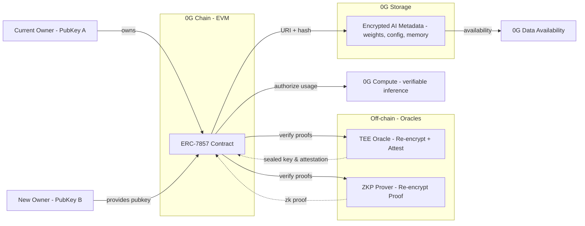
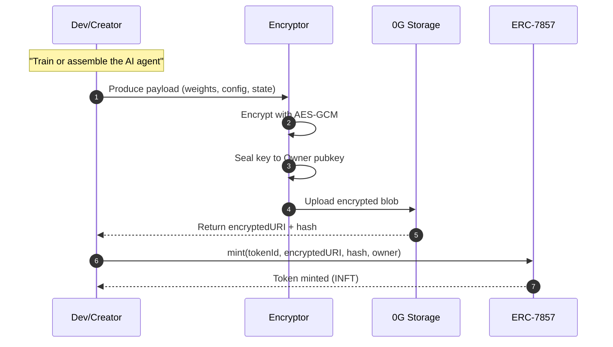
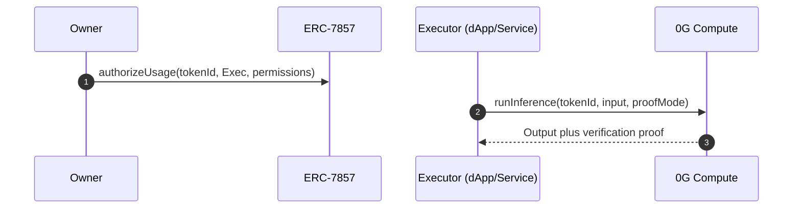
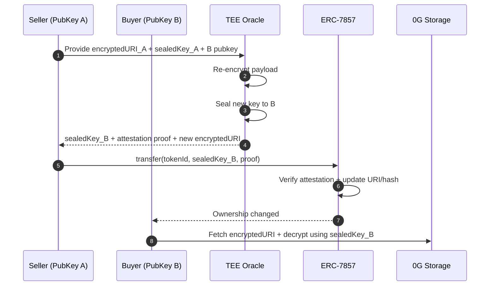
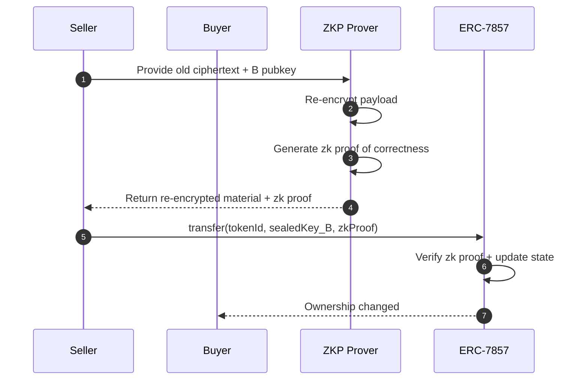

# INFT (Intelligent NFTs) — Deep Technical Walkthrough (GitHub‑compatible)

This version fixes Mermaid syntax so diagrams render on GitHub.

---

## 1) System Architecture (Flowchart)



---

## 2) Lifecycle: Minting



---

## 3) Lifecycle: Authorized Usage (AI-as-a-Service without transfer)



---

## 4) Lifecycle: Transfer (TEE path)



---

## 5) Lifecycle: Transfer (ZKP path, conceptual)



---

## 6) Data Model (Concise)

- **On-chain (ERC-7857):** `encryptedURI`, `metadataHash`, usage authorizations.  
- **Off-chain (0G Storage):** encrypted bundle `{modelWeights, tokenizer, config, memory, adapters, provenance, version}`.  
- **Crypto:** AES‑GCM for payload; asymmetric key wrapping to the owner’s public key; oracle proof (TEE attestation or ZK proof) verified by the contract.

---

## 7) Minimal Integration Steps

### Minting
1. Serialize agent artifacts.  
2. Encrypt payload; wrap symmetric key to owner public key.  
3. Upload encrypted blob to 0G Storage → `encryptedURI`, `metadataHash`.  
4. Mint ERC‑7857 with URI + hash.  

### Authorized Usage
1. `authorizeUsage(tokenId, executor, permissions)`.  
2. Executor calls 0G Compute with `tokenId` and inputs.  
3. Receive outputs + proof.  

### Transfer
1. Recipient shares public key.  
2. TEE or ZKP service re‑encrypts payload for recipient and returns proof.  
3. Contract verifies proof and updates state.  
4. Recipient decrypts with sealed key.  

---

## 8) On-Chain vs Off-Chain Responsibilities

### On-Chain (0G Chain, Solidity)
- Token ownership (ERC-721 base).  
- ERC-7857 extensions: `transfer`, `clone`, `authorizeUsage`.  
- Stores lightweight references: `encryptedURI` and `metadataHash`.  
- Verifies proofs (TEE attestations or ZKPs).  
- Updates state on valid transfer or authorization.  

```solidity
contract ERC7857 is ERC721 {
    mapping(uint256 => string) public encryptedURI;
    mapping(uint256 => bytes32) public metadataHash;

    function transfer(
        address from,
        address to,
        uint256 tokenId,
        bytes calldata sealedKeyForTo,
        bytes calldata proof
    ) external {
        require(verifyProof(proof, metadataHash[tokenId]), "Invalid proof");
        _transfer(from, to, tokenId);
    }
}
```

### Off-Chain (Services + Storage + Compute)
- **0G Storage:** hosts encrypted AI bundles permanently.  
- **TEE/ZKP Oracle:** performs re-encryption, produces proof of correctness.  
- **0G Compute:** executes inference jobs when authorized.  

```typescript
function reencrypt(oldCipher, oldKey, newPubKey) {
    // inside TEE or as ZKP circuit
    decrypted = decrypt(oldCipher, oldKey);
    newCipher = encrypt(decrypted, newPubKey);

    if (TEE) {
        return { sealedKey: newCipher, proof: enclaveAttestation() };
    } else {
        return { sealedKey: newCipher, proof: generateZKProof(oldCipher, newCipher) };
    }
}
```

**Rule of Thumb:**  
- On-chain = ownership + references + proof checks.  
- Off-chain = heavy lifting (storage, encryption, inference, proof generation).  
