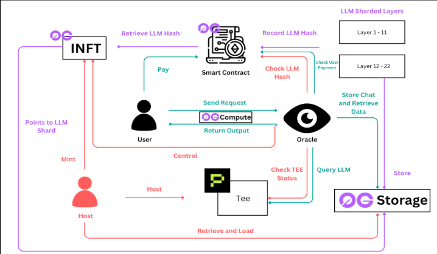
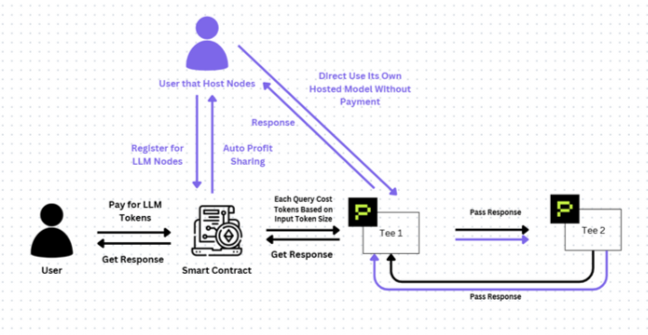

# TeeTee - Decentralized AI Inference with TEE & 0G Network

<div align="center">

[](https://teetee.site)
[](LICENSE)
[](https://0g.ai)
[](https://0g.ai)

**Democratizing AI through secure, verifiable, and decentralized inference powered by Trusted Execution Environments**

[Live Demo](https://teetee.site) • [Technical Paper](https://docs.google.com/document/d/1D_g_0f35Rdzx2W_6PkjKKRscLBLe_7QvbgQBehHOtR4/edit?tab=t.0) • [Documentation](https://docs.google.com/document/d/1pqDrJoYoBfVG19Kxu0-9uSHfwEq3ZQjp8d1CU9Pd-Kk/edit?usp=sharing) • [Video Demo](https://drive.google.com/drive/folders/1eWDgBJ_o2jr5xT2U_ZYclxhAAt15G4HJ?usp=sharing)

**Twitter Threads:** [Thread 1](https://x.com/ilovedahmo/status/1986064335354126573) • [Thread 2](https://x.com/derek2403/status/1986100026100322593) • [Thread 3](https://x.com/marcustan1337/status/1986066934362943503) • [Thread 4](https://x.com/avoisavo/status/1986130154222199032)

🏆 **0G WaveHack Wave 5 Submission** | Production-Ready | Mainnet Deployed | Fully Verified

</div>

---

## 📋 Table of Contents

- [Overview](#-overview)
- [Verified Mainnet Contracts](#-verified-mainnet-contracts-0g-network)
- [Unique Selling Point (USP)](#-unique-selling-point-usp)
- [Architecture](#-architecture)
- [Features](#-features)
- [Tech Stack](#-tech-stack)
- [Getting Started](#-getting-started)
  - [Prerequisites](#prerequisites)
  - [Frontend Setup](#1-frontend-setup)
  - [Backend Setup](#2-backend-setup)
  - [Smart Contract Deployment (Optional)](#3-smart-contract-deployment-optional)
  - [iNFT Deployment (Optional)](#4-inft-deployment-optional)
- [Project Structure](#-project-structure)
- [Environment Variables](#-environment-variables)
- [Development](#-development)
- [Future Roadmap](#-future-roadmap)
- [Contributing](#-contributing)
- [Community & Support](#-community--support)
- [License](#-license)

---

## 🌟 Overview

**TeeTee** is a production-ready decentralized AI inference platform that brings together blockchain technology, Trusted Execution Environments (TEE), and the 0G Network to create a secure, transparent, and accessible AI ecosystem. Our platform enables users to host, access, and monetize Large Language Models (LLMs) while maintaining privacy and verifiability.

### Key Innovations

- **🔐 TEE-Secured Inference**: All AI computations run in hardware-isolated Trusted Execution Environments, ensuring data privacy and tamper-proof execution
- **⚡ 0G Network Integration**: Leverages 0G's high-performance infrastructure:
  - **0G Storage**: Model weights, chat history, and metadata stored at 2GB/s throughput (~$10/TB)
  - **0G Chain**: On-chain authorization, credit management, and settlement (2,500+ TPS)
- **💎 iNFT Token Standard**: Implements ERC-7857 for tokenized AI agent ownership with secure, privacy-preserving metadata transfer
- **🏥 Auto-Failover System**: Health oracle continuously monitors shard status and automatically routes traffic to healthy endpoints
- **💰 Credit-Based Economy**: Fair, transparent metering and settlement system for AI usage with verifiable on-chain transactions

### 📜 Verified Mainnet Contracts (0G Network)

All core contracts are deployed and verified on 0G mainnet:

| Contract | Address | Purpose | Explorer Link |
|----------|---------|---------|---------------|
| **CreditUse** | `0xd1ce92b2c95a892fe1166e20b65c73b33b269f7e` | Credit management and usage metering | [View Contract](https://chainscan.0g.ai/address/0xd1ce92b2c95a892fe1166e20b65c73b33b269f7e?tab=contract-viewer) |
| **OracleStub** | `0x20f8f585f8e0d3d1fce7907a3c02aeaa5c924707` | Oracle interface for health checking | [View Contract](https://chainscan.0g.ai/address/0x20f8f585f8e0d3d1fce7907a3c02aeaa5c924707?tab=contract-viewer) |
| **DataVerifierAdapterFixed** | `0x8889106de495dc1731a9b60a58817de6e0142ac0` | Data verification adapter | [View Contract](https://chainscan.0g.ai/address/0x8889106de495dc1731a9b60a58817de6e0142ac0?tab=contract-viewer) |
| **INFT (ERC-7857)** | `0x56776a7878c7d4cc9943b17d91a3e098c77614da` | Intelligent NFT for AI agents | [View Contract](https://chainscan.0g.ai/address/0x56776a7878c7d4cc9943b17d91a3e098c77614da?tab=contract-viewer) |


#### 🔗 Mainnet Transaction Proofs

| Transaction Type | Transaction Hash | Description |
|-----------------|------------------|-------------|
| **0G Storage** | [`0x183d6cdc0e5ce2e3174e36a5842411208ff8334df560dd2dcc8c222f05df932f`](https://chainscan.0g.ai/tx/0x183d6cdc0e5ce2e3174e36a5842411208ff8334df560dd2dcc8c222f05df932f) | Chat history uploaded to 0G Storage Mainnet |
| **INFT Minting** | [`0x3e8144b2d355ccbac0f86371966c0903e46b0099bc0207c5923834c26da6535d`](https://chainscan.0g.ai/tx/0x3e8144b2d355ccbac0f86371966c0903e46b0099bc0207c5923834c26da6535d) | INFT token minted on 0G Mainnet |
| **Register LLM** | [`0x3350f908d68a4afddb2f5d6fc3a35ecf135d1059eac0cdd4db45b8fa22fbcba4`](https://chainscan.0g.ai/tx/0x3350f908d68a4afddb2f5d6fc3a35ecf135d1059eac0cdd4db45b8fa22fbcba4) | Smart contract register LLM on 0G Mainnet |

#### 🐦 Building Journey & Community

| Thread | Author | Link |
|--------|--------|------|
| **Thread 1** | @ilovedahmo | [View on X](https://x.com/ilovedahmo/status/1986064335354126573) |
| **Thread 2** | @derek2403 | [View on X](https://x.com/derek2403/status/1986100026100322593) |
| **Thread 3** | @marcustan1337 | [View on X](https://x.com/marcustan1337/status/1986066934362943503) |
| **Thread 4** | @avoisavo | [View on X](https://x.com/avoisavo/status/1986130154222199032) |

These threads document key milestones, deployment details, and community engagement throughout our development journey.

📄 **Research & White Paper**: [TeeTee Technical Paper](https://docs.google.com/document/d/1D_g_0f35Rdzx2W_6PkjKKRscLBLe_7QvbgQBehHOtR4/edit?tab=t.0) - Our self-researched approach to distributed LLM inference in TEE

---

## 🎯 Unique Selling Point (USP)

### What Makes TeeTee Stand Out in the 0G Ecosystem?

**TeeTee is the world's first implementation of layer-sharded LLM inference across distributed Trusted Execution Environments (TEE), backed by original research and deployed on 0G's high-performance infrastructure.**

#### 1. **First Implementation of LLM Sharding in TEE (Research-Backed)**

**The Problem:** Today's AI landscape forces a painful choice between **privacy vs. price**:
- 🚨 Ship sensitive data to third-party LLMs (OpenAI, Anthropic) → **Zero privacy**
- 💸 Self-host models on your own hardware → **$100K+ upfront** (GPUs, maintenance, ops)
- 🤏 Most teams settle for smaller, weaker models due to cost constraints

**Our Solution:** TeeTee introduces a **novel layer-sharding approach** where we split large language models by layers and distribute them across multiple verifiable TEEs:

```
Example: GPT-style 48-layer model
├─ TEE Shard 1: Layers 1-12
├─ TEE Shard 2: Layers 13-24
├─ TEE Shard 3: Layers 25-36
└─ TEE Shard 4: Layers 37-48
```

**How It Works:**
- 🔗 **Request Flows Through TEE Chain**: Your query enters TEE1 → TEE2 → ... → TEEn
- 🔐 **Zero Raw Data Exposure**: Only intermediate activations/tensors pass between shards (never raw text or weights)
- ✅ **Hardware Attestation per Hop**: Each TEE emits cryptographic proof of secure execution
- 🎯 **Single Entry Endpoint**: Orchestrator coordinates the chain; final output returns to you
- 💰 **On-Chain Settlement**: Credits/payments settle automatically on 0G mainnet
- 📦 **0G Storage Integration**: Model weights stored on 0G Storage's decentralized network (2GB/s throughput, ~$10/TB)
- 💬 **Chat History on 0G**: Conversation logs and user context stored on 0G Storage for retrieval and continuity

**Why This Matters:**
- 🛡️ **Private Data Stays Private**: Verifiable TEE execution with no plaintext exposure
- 📈 **Models Scale Beyond Single-TEE Limits**: Run 70B+ parameter models that won't fit in one TEE
- 💵 **10x Cost Reduction**: Companies host just one shard (~$10K) yet access the full, high-quality model
- 🌐 **Resilient & Decentralized**: No vendor lock-in, auto-failover, no single point of failure
- 💾 **Cost-Effective Storage**: 0G Storage provides 10-100x cheaper storage vs. centralized alternatives
- 🔬 **Research-Validated**: [Read our technical white paper](https://docs.google.com/document/d/1D_g_0f35Rdzx2W_6PkjKKRscLBLe_7QvbgQBehHOtR4/edit?tab=t.0) documenting our approach

**Production Ready:** Unlike theoretical proposals, TeeTee is **live at [teetee.site](https://teetee.site)** with real models (DeepSeek V3, Llama 3.3) serving production traffic today.

**🌐 Impact on 0G Ecosystem:**

TeeTee's research-backed LLM sharding solves the "$100K GPU barrier" that blocks most companies from adopting private AI. By enabling **enterprise-grade AI privacy at consumer prices**, we're creating the **first killer use case** that drives real companies to 0G Network:

- 📊 **Enterprise Demand**: Healthcare, legal, and financial companies need private AI but can't afford $100K+ GPU infrastructure. TeeTee makes them **0G users overnight**
- 💰 **Storage Revenue**: Every TeeTee deployment stores gigabytes of model weights + chat history on **0G Storage**, creating sustained demand and revenue for 0G storage providers
- ⛓️ **On-Chain Activity**: Every inference request = on-chain credit transaction on **0G Chain**, directly increasing network activity and TVL
- 👥 **Developer Onboarding**: Our research proves decentralized AI works at production scale. Companies building with TeeTee **become 0G developers** (using 0G Storage SDK, 0G Chain contracts)
- 🔄 **Network Effects**: As more shards join TeeTee, the network becomes more resilient and cost-effective, attracting more hosters → more storage → more on-chain settlement → **0G ecosystem growth**

**Bottom Line:** TeeTee isn't just using 0G—we're the **gateway that brings enterprises to 0G** by solving a real pain point (privacy + cost) that Web2 AI platforms can't address.

---

#### 2. **ERC-7857 (iNFT) Implementation on 0G**
TeeTee pioneers **Intelligent NFTs** on 0G Network, enabling:
- 🎨 **AI Agent Ownership**: Tokenize and trade AI models as NFTs with embedded intelligence
- 🔐 **Secure Metadata Transfer**: When an iNFT is sold, the AI model, memory, and traits transfer securely via oracle-assisted encryption
- 💼 **New Economic Models**: Create AI agent marketplaces, rental systems, and royalty structures impossible with traditional NFTs
- 📦 **0G Storage for AI Metadata**: Neural network weights, agent memory, and character traits stored on **0G Storage** with encryption
- 🔄 **Decentralized Metadata Updates**: Dynamic AI agent evolution tracked and stored on 0G's decentralized infrastructure

This positions TeeTee as the **infrastructure layer for the future AI agent economy** on 0G.

**🌐 Impact on 0G Ecosystem:**

iNFTs unlock the **$100B+ AI agent market** for 0G by making AI models tradable, ownable assets—a use case impossible on traditional chains without 0G's high-performance storage:

- 🛒 **AI Marketplaces on 0G**: Companies building AI agent marketplaces (like OpenSea for AI models) **must use 0G Storage** to handle gigabyte-sized neural network files at affordable costs (~$10/TB vs. $1000+/TB on centralized storage)
- 🏢 **Enterprise Licensing**: B2B AI companies can now sell/license their models as iNFTs. Each sale = metadata stored on **0G Storage** + ownership transfer on **0G Chain** = sustained network usage
- 💎 **NFT Ecosystem Expansion**: Traditional NFT projects (PFPs, gaming) can now embed AI agents into their tokens. A gaming NFT with embedded AI personality = model weights on **0G Storage** = new use case driving 0G adoption
- 🤖 **Autonomous AI Agents**: Future DAOs and autonomous agents need on-chain identity. TeeTee's iNFT standard becomes the **de facto choice** for AI agent identity on 0G, creating a moat
- 📈 **Storage & Compute Growth**: Every iNFT mint/transfer = metadata operations on 0G Storage + oracle verification on 0G Chain = **direct revenue for 0G validators and storage providers**

**Bottom Line:** iNFTs make 0G the **home for the AI agent economy**. Companies building AI marketplaces, licensing platforms, or autonomous agents will choose 0G because TeeTee proves the infrastructure works at scale.

---

#### 3. **Fair, Transparent Credit Economy**
Unlike opaque subscription models or centralized billing, TeeTee uses:
- 💰 **Pay-Per-Token**: Only pay for what you use, down to the token level
- 📊 **On-Chain Verification**: Every credit transaction is verifiable on **0G Chain mainnet** with full transparency
- 🎁 **Hoster Incentives**: Model hosters earn directly from usage with automated settlements on **0G Chain**
- 🔓 **No Lock-In**: Credits are portable and can be withdrawn anytime via **0G Chain** smart contracts
- 👥 **Auto-Profit Sharing**: When users query your hosted shard, you earn instantly—settled on-chain
- 💳 **Usage Logs on 0G Storage**: Every query, token count, and payment is logged to **0G Storage** for auditing and dispute resolution

Our credit system aligns incentives between users, hosters, and the platform—**creating a sustainable, decentralized AI economy** where anyone can participate.

**🌐 Impact on 0G Ecosystem:**

TeeTee's transparent credit economy creates **high-frequency on-chain activity** and drives enterprise adoption by solving AI's biggest pain point: unpredictable costs and vendor lock-in:

- ⛓️ **Thousands of Daily Transactions**: Every AI inference = on-chain credit deduction on **0G Chain**. With 1M+ queries/day (our 2025 target), that's **1M+ on-chain transactions daily** = sustained network activity and gas revenue
- 🏦 **Enterprise Budget Clarity**: CFOs hate unpredictable AI bills. TeeTee's pay-per-token model with on-chain auditing solves this. Companies that adopt TeeTee for cost transparency **become 0G Chain users by default**
- 💰 **Hoster Economy**: Anyone can host a shard and earn. A university hosting one shard earns passive income when researchers use it → **0G becomes the platform where academic institutions monetize their compute**
- 📈 **TVL Growth**: Credits are purchased and staked on **0G Chain**. As TeeTee scales to 50K users (2025 target), millions in credits lock into 0G smart contracts = **direct TVL growth**
- 🔄 **Usage Data = 0G Storage Revenue**: Every query's token count, cost, and metadata logged to **0G Storage** for compliance and auditing. Enterprise customers need these logs for SOC2/ISO compliance → **sustained storage revenue**
- 🌍 **Global Micropayments**: TeeTee enables researchers in developing countries to access AI for pennies. This **global accessibility** showcases 0G's low fees and fast settlement—a killer demo for enterprise onboarding

**Bottom Line:** TeeTee's credit economy transforms 0G from "another L1" into **the global settlement layer for AI payments**. Every company adopting TeeTee = company using 0G Chain daily for real business operations.

---

## 🏗 Architecture

TeeTee is built on a modular, full-stack architecture consisting of five core components:

### 1. **Frontend** (`/frontend`)
**Purpose**: User-facing Next.js application providing the interface for AI inference and LLM management

**Key Features**:
- Modern, responsive UI built with React 19, Next.js 16, and Tailwind CSS
- Spline-powered 3D visualizations for enhanced UX
- Comprehensive Console for adding/managing LLMs
- Hoster Dashboard with earnings analytics and shard status monitoring
- Model marketplace with filters, per-model icons, and usage insights
- Secure wallet integration via RainbowKit and wagmi
- Real-time credit management and withdrawal flows

**Tech Stack**: Next.js, React, TypeScript, Tailwind CSS, ethers.js, RainbowKit, Spline

---

### 2. **Backend** (`/backend`)
**Purpose**: Oracle service that bridges off-chain TEE computation with on-chain smart contracts

**Key Features**:
- Health checking service for TEE endpoints
- Shard lifecycle management (registration, validation, failover)
- Model hash verification for authenticity
- RESTful API for inference routing
- Duplicate URL prevention and host validation
- Integration with 0G Network for decentralized storage
- Circuit breaker pattern for resilience

**Tech Stack**: Node.js, TypeScript, Express, ethers.js, 0G-TS-SDK

---

### 3. **Smart Contracts** (`/smartcontract`)
**Purpose**: On-chain logic for credit management and usage metering

**Key Components**:
- **`creditUse.sol`**: Manages LLM credit consumption, authorization, and metering. Implements pay-per-token model with verifiable on-chain settlement
- **`subscription.sol`**: Handles subscription plans and recurring payment logic

**Blockchain**: Deployed on 0G mainnet (EVM-compatible Layer 1)

**Key Features**:
- Gas-optimized operations (storage packing, custom errors, selective events)
- Safe math operations with overflow protection
- Credit minting, transfer, and burn mechanisms
- Per-shard usage tracking and settlement

---

### 4. **0G iNFT** (`/0g-INFT`)
**Purpose**: Implementation of ERC-7857 standard for tokenizing AI agents with secure metadata transfer

**Key Features**:
- Privacy-preserving metadata encryption
- Secure transfer protocol using trusted oracles and TEEs
- Integration with 0G Storage for decentralized model hosting
- Ownership-based authorization for hosted LLMs
- Dynamic metadata management for evolving AI agents
- Hash commitment and cryptographic proof verification

**Smart Contracts**:
- **`INFT.sol`**: Core ERC-7857 implementation
- **`INFTFixed.sol`**: Optimized version with latest enhancements
- **`OracleStub.sol`**: Oracle interface for metadata verification

**Use Cases**:
- Tokenized AI agent ownership and trading
- Access control for premium models
- Verifiable provenance of AI models
- Decentralized AI marketplaces

---

### 5. **Model Splitting Research** (`/ModelSplitting-v1`)
**Purpose**: Experimental research on distributed model inference across multiple shards

**Key Concepts**:
- Algorithm for splitting large language models into distributable shards
- Load balancing strategies for parallel inference
- Coordination protocols for multi-shard computation
- Proof-of-concept implementation in Python

**Research Goals**:
- Reduce single-point-of-failure risks
- Enable horizontal scaling of massive models
- Improve inference latency through parallelization
- Explore federated learning possibilities

**Status**: Early-stage research, not yet integrated into production

---

### 6. **LLM Server** (`/llm`)
**Purpose**: Node.js server for running LLM inference with OpenAI-compatible API interface

**Features**:
- Phala Cloud GPU TEE integration for confidential AI
- Support for multiple models (DeepSeek V3, Llama 3.3, GPT-OSS, Qwen)
- Streaming and non-streaming response modes
- RESTful endpoints (`/chat`, `/chat/stream`, `/inference`, `/models`)
- Hardware-level privacy protection with cryptographic execution proofs

---

### Architecture Diagrams & Flow

TeeTee's architecture consists of three interconnected flows:

- **🟣 Purple: Platform (TeeTee) Flow** - Core infrastructure and shard management
- **🔴 Red: Host Flow** - Model hosting and TEE deployment
- **🔵 Teal: User Flow** - End-user inference and payments

---

#### Complete Architecture Overview



**The complete system architecture showing all components and their interactions:**
- **INFT Management**: Minting, authorization, and ownership on 0G Chain
- **Smart Contract Layer**: Credit management and on-chain settlements
- **Oracle System**: Health monitoring, TEE status verification, and inference routing
- **0G Storage**: Decentralized storage for model weights, chat history, and metadata
- **TEE Hosts**: Trusted Execution Environment nodes running model shards
- **User Interface**: Frontend for queries, Console for management, and Dashboard for analytics

---

#### 🟣 Platform Flow: Shard Publishing & Registry

**1. Publish Shard Artifacts (Platform Operation)**
```
Package Shards → Upload to 0G Storage → Record Hash on 0G Chain → Link to iNFT
```

- **Package Each Shard**: Split model by layers (e.g., Layers 1-11, Layers 12-22)
- **Upload to 0G Storage**: Store sharded model weights on decentralized storage
- **Record Content Hash**: Register storage URI in registry contract on 0G Chain
- **Link to iNFT Metadata**: iNFT metadata points to uploaded LLM shard location on 0G Storage

This ensures deterministic, verifiable model deployment across the network.

---

#### 🔴 Host Flow: Onboarding & Deployment



**1. Host Onboarding with iNFT Minting**
- Host mints or receives an iNFT pointing to shard's encrypted metadata
- iNFT contains storage location on 0G Storage
- Ownership tracked on 0G Chain via ERC-7857

**2. Secure Retrieval & TEE Provisioning**
- Host's TEE-backed node fetches shard from 0G Storage
- Node loads model weights into secure TEE environment
- Exposes `/generate` and `/process` endpoints
- Registers endpoint URL and shard hash on 0G Chain

**3. Activation & Verification**
- Oracle validates deployed shard hash matches iNFT metadata
- Confirms node is reachable and serving (health check)
- On success: Oracle activates iNFT and enables revenue sharing
- On failure: Access blocked until hash/endpoint issues resolved

**4. Monitoring & Lifecycle**
- Oracle performs periodic health checks (endpoint liveness)
- If node goes offline or hash mismatches → access suspended
- Traffic automatically rerouted to healthy providers
- iNFTs can be deactivated/rotated on operator changes or upgrades

**Host Benefits:**
- **Direct Access**: Hosts whitelisted for cost-free access to their own nodes
- **Auto-Profit Sharing**: Earn when others use your shard
- **Register for LLM Nodes**: Join existing models to earn passive income

---

#### 🔵 User Flow: Payments & Inference

**1. Payments & Access**
- Users pay credits into smart contract on 0G Chain (0.001 0G = 200 credits)
- Contract meters requests based on token usage
- Settles payments with providers via 0G Compute Network (permissionless)
- All transactions verifiable on-chain

**2. Query Relay & Inference**


**Layer-Sharded Inference Flow:**
```
User Query → TEE 1 (Layers 1-11) → TEE 2 (Layers 12-22) → ... → TEE N → Response
```

- **Lightweight Relayer**: Oracle service watches on-chain events and routes requests
- **Distributed Processing**: Query flows through multiple TEE shards
  - Each shard processes its assigned layers
  - Only intermediate activations/tensors pass between TEEs (never raw text or weights)
  - Each hop emits hardware attestation for verification
- **Single Entry Endpoint**: Orchestrator coordinates the entire chain
- **Final Output**: Assembled response returns to user
- **On-Chain Settlement**: Credits/payments settle automatically on 0G mainnet
- **Proof Anchoring**: Attestation references stored on-chain for auditability

**Key Security Features:**
- 🔒 **Zero Raw Data Exposure**: Only tensors pass between shards
- ✅ **Hardware Attestation**: Each TEE proves secure execution
- 🛡️ **Verifiable Compute**: Cryptographic proof at every hop

**3. Logs & Transcripts**
- User chat history persisted to 0G Storage for privacy
- Request metadata stored for auditing
- Retrieval for conversation continuity
- All data encrypted and owned by user

---

#### Cost Advantages

**Traditional Approach:**
- Single entity hosts entire model: $100K+ upfront (GPUs + infrastructure)
- High maintenance costs, single point of failure

**TeeTee's Sharded Approach:**
- Companies host just **one shard** (~$10K investment)
- Access full, high-quality model via the network
- 10x cost reduction while maintaining privacy
- Earn revenue when others use your shard
- Resilient and decentralized (no vendor lock-in)

---

## ✨ Features

### For AI Consumers
- 🤖 **Access Premium Models**: Query state-of-the-art LLMs (DeepSeek V3, Llama 3.3, etc.) through a simple interface
- 💳 **Credit-Based Payments**: Fair, transparent pay-per-token pricing with on-chain verification
- 🔒 **Privacy Guaranteed**: All inference runs in TEE with hardware-level isolation
- ⚡ **Low Latency**: Auto-failover ensures queries route to healthy, fast endpoints
- 📊 **Usage Analytics**: Track your credit consumption and query history

### For Model Hosters
- 💰 **Monetize Models**: Earn rewards by hosting LLMs and serving inference requests
- 📈 **Earnings Dashboard**: Real-time analytics on usage, revenue, and shard performance
- 🛡️ **Automated Health Checks**: Oracle monitors your endpoints and handles failover
- 🎯 **Easy Onboarding**: Register shards through intuitive Console interface
- 🔐 **Ownership Control**: iNFT-based authorization ensures only you control your models

### For Developers
- 🔧 **OpenAI-Compatible API**: Drop-in replacement for existing AI applications
- 📚 **Comprehensive SDKs**: TypeScript/JavaScript support with 0G-TS-SDK integration
- 🌐 **Cross-Chain Ready**: EVM-compatible, works with existing Web3 infrastructure
- 🧪 **Full Test Coverage**: Unit and integration tests across contracts, oracle, and frontend
- 📖 **Detailed Documentation**: Hosting guides, API references, and troubleshooting FAQs

---

## 🛠 Tech Stack

### Frontend
- **Framework**: Next.js 16 (Turbopack), React 19
- **Styling**: Tailwind CSS 4, Framer Motion, Spline
- **Web3**: ethers.js 6, RainbowKit, wagmi, viem
- **Storage**: 0G-TS-SDK for decentralized storage
- **UI Libraries**: Radix UI, Lucide Icons, GSAP

### Backend
- **Runtime**: Node.js with TypeScript
- **Framework**: Express.js
- **Web3**: ethers.js 6, 0G-TS-SDK
- **Reliability**: Opossum (circuit breaker), express-rate-limit
- **Communication**: Server-Sent Events (SSE) for streaming

### Smart Contracts
- **Language**: Solidity ^0.8.0
- **Development**: Hardhat
- **Network**: 0G Mainnet (EVM-compatible)
- **Standards**: ERC-7857 (iNFT), ERC-20 (credits)

### Infrastructure
- **Blockchain**: 0G Network (2,500+ TPS, sub-second finality)
- **Storage**: 0G Storage (2GB/s throughput, ~$10/TB)
- **Compute**: Phala Cloud GPU TEE
- **Verification**: Proof-of-Inference (PoI), Proof-of-Random-Access (PoRA)

---

## 🚀 Getting Started

### Prerequisites

Before you begin, ensure you have the following installed:

- **Node.js** v20+ and npm (or yarn)
- **Git** for cloning the repository
- **MetaMask** or compatible Web3 wallet
- **0G Network RPC** access (for mainnet interaction)

---

### 1. Frontend Setup

The frontend is a Next.js application that provides the user interface for TeeTee.

#### Step 1: Navigate to Frontend Directory
```bash
cd frontend
```

#### Step 2: Install Dependencies
```bash
npm install
```

#### Step 3: Configure Environment Variables
Create a `.env.local` file in the `frontend` directory:

```env
# No environment variables required for basic frontend operation
# The frontend connects to public 0G RPC endpoints by default

# Optional: If using custom backend URL
NEXT_PUBLIC_BACKEND_URL=http://localhost:3002

# Optional: If using custom smart contract addresses
NEXT_PUBLIC_CREDIT_CONTRACT=0x...
NEXT_PUBLIC_INFT_CONTRACT=0x...
```

#### Step 4: Run Development Server
```bash
npm run dev
```

The frontend will be available at `http://localhost:3000`

#### Step 5: Build for Production
```bash
npm run build
npm start
```

#### Step 6: Testing with Demo Endpoints (Optional)

For quick testing without setting up your own TEE infrastructure, we've pre-deployed demo endpoints you can use:

```
Demo Endpoint 1: https://1e8ddb822fabefe60399b39bbfb83478c1a12e3c-3001.dstack-pha-prod7.phala.network/
Demo Endpoint 2: https://f39ca1bc5d8d918a378cd8e1d305d5ac3e75dc81-3001.dstack-pha-prod7.phala.network/
```

**How to use:**
1. Navigate to the Console page in the frontend
2. Click "Add Model"
3. When you reach the "TEE Shard URL" step, hover over "Get free demo links"
4. Copy one of the demo endpoints and paste it into the Shard URL field
5. The system will automatically verify the endpoint

These demo endpoints are production-ready TEE nodes running on Phala Cloud for testing purposes.

---

### 2. Backend Setup

The backend oracle service handles health checking, shard management, and inference routing.

#### Step 1: Navigate to Backend Directory
```bash
cd backend
```

#### Step 2: Install Dependencies
```bash
npm install
```

#### Step 3: Configure Environment Variables
Create a `.env` file in the `backend` directory:

```env
# Private key for signing transactions (REQUIRED)
PRIVATE_KEY=your_wallet_private_key_here

# RedPill API key for TEE verification (REQUIRED)
REDPILL_API_KEY=your_redpill_api_key_here

# Optional: Custom RPC endpoint
RPC_URL=https://evmrpc-testnet.0g.ai

# Optional: Backend port
PORT=3002

# Optional: Smart contract addresses (if not using defaults)
CREDIT_CONTRACT=0x...
INFT_CONTRACT=0x...
REGISTRY_CONTRACT=0x...
```

**⚠️ Security Warning**: Never commit your `.env` file or share your private key!

#### Step 4: Run Development Server
```bash
npm run dev
```

#### Step 5: Build and Run Production Server
```bash
npm run build
npm run serve
```

The backend API will be available at `http://localhost:3002`

---

### 3. Smart Contract Deployment (Optional)

Only required if you want to deploy your own instances of the credit and subscription contracts.

#### Step 1: Navigate to Smart Contract Directory
```bash
cd smartcontract
```

#### Step 2: Install Dependencies
```bash
npm install
```

#### Step 3: Configure Environment Variables
Create a `.env` file in the `smartcontract` directory:

```env
# Private key for deploying contracts
PRIVATE_KEY=your_wallet_private_key_here

# 0G Network RPC URL
RPC_URL=https://evmrpc-testnet.0g.ai

# Optional: Etherscan API key for verification
ETHERSCAN_API_KEY=your_etherscan_api_key_here
```

#### Step 4: Deploy Contracts
```bash
# Deploy to 0G testnet
npx hardhat run scripts/deploy.js --network galileo

# Deploy to 0G mainnet
npx hardhat run scripts/deploy.js --network mainnet
```

#### Step 5: Verify Contracts (Optional)
```bash
npx hardhat verify --network mainnet DEPLOYED_CONTRACT_ADDRESS "constructor_args"
```

---

### 4. iNFT Deployment (Optional)

Only required if you want to deploy your own iNFT (ERC-7857) contracts for AI agent tokenization.

#### Step 1: Navigate to 0G-INFT Directory
```bash
cd 0g-INFT
```

#### Step 2: Install Dependencies
```bash
npm install
```

#### Step 3: Configure Environment Variables
Create a `.env` file in the `0g-INFT` directory:

```env
# Private key for deploying contracts
PRIVATE_KEY=your_wallet_private_key_here

# 0G Network RPC URL
RPC_URL=https://evmrpc-testnet.0g.ai

# Optional: 0G Storage configuration
STORAGE_RPC_URL=https://storage-rpc.0g.ai
STORAGE_FLOW_ADDRESS=0x...

# Optional: Oracle configuration
ORACLE_ADDRESS=0x...
```

#### Step 4: Deploy iNFT Contracts
```bash
# Using deployment script
./deploy.sh

# Or manually with Hardhat
npx hardhat run scripts/deploy-inft.ts --network galileo
```

#### Step 5: Verify Deployment
```bash
npx hardhat run scripts/verify-deployment.ts --network galileo
```

**📖 For detailed deployment instructions**, see [`0g-INFT/DEPLOYMENT-GUIDE.md`](0g-INFT/DEPLOYMENT-GUIDE.md)

---

## 📁 Project Structure

```
TeeTee-v2/
├── frontend/                  # Next.js user interface
│   ├── components/            # React components (Console, Models, Dashboard)
│   ├── pages/                 # Next.js pages and API routes
│   ├── lib/                   # Contract ABIs and Web3 utilities
│   ├── utils/                 # Helper functions and hooks
│   └── styles/                # Global CSS and Tailwind config
│
├── backend/                   # Oracle service (Node.js/Express)
│   ├── index.ts               # Main server entry point
│   ├── networkConfig.ts       # 0G Network configuration
│   └── dist/                  # Compiled JavaScript output
│
├── smartcontract/             # Credit & subscription contracts
│   ├── contracts/             # Solidity smart contracts
│   │   ├── creditUse.sol      # Credit management
│   │   └── subscription.sol   # Subscription logic
│   ├── scripts/               # Deployment and utility scripts
│   └── hardhat.config.js      # Hardhat configuration
│
├── 0g-INFT/                   # ERC-7857 iNFT implementation
│   ├── contracts/             # Solidity smart contracts
│   │   ├── INFT.sol           # Core ERC-7857 implementation
│   │   ├── INFTFixed.sol      # Optimized version
│   │   └── OracleStub.sol     # Oracle interface
│   ├── scripts/               # Deployment and testing scripts
│   ├── deployments/           # Deployment artifacts
│   ├── storage/               # Encrypted metadata storage utilities
│   ├── frontend/              # iNFT demo frontend
│   └── offchain-service/      # Oracle service for metadata transfer
│
├── ModelSplitting-v1/         # Research on distributed inference
│   ├── main.py                # Main execution script
│   └── split.py               # Model splitting algorithm
│
├── llm/                       # LLM inference server
│   ├── server.js              # OpenAI-compatible API server
│   ├── Dockerfile             # Docker containerization
│   └── docker-compose.yml     # Multi-service orchestration
│
└── README.md                  # This file
```

---

## 🔐 Environment Variables

### Backend Environment Variables (Required for Basic Operation)

| Variable | Description | Required | Example |
|----------|-------------|----------|---------|
| `PRIVATE_KEY` | Private key for signing transactions | ✅ Yes | `0xabc123...` |
| `REDPILL_API_KEY` | API key for RedPill TEE verification | ✅ Yes | `rp_abc123...` |
| `RPC_URL` | 0G Network RPC endpoint | ❌ No | `https://evmrpc-testnet.0g.ai` |
| `PORT` | Backend server port | ❌ No | `3002` |

### Smart Contract Deployment Variables (Optional)

| Variable | Description | Required | Example |
|----------|-------------|----------|---------|
| `PRIVATE_KEY` | Private key for deploying contracts | ✅ Yes | `0xabc123...` |
| `RPC_URL` | 0G Network RPC endpoint | ✅ Yes | `https://evmrpc-testnet.0g.ai` |
| `ETHERSCAN_API_KEY` | For contract verification | ❌ No | `ABC123...` |

### iNFT Deployment Variables (Optional)

| Variable | Description | Required | Example |
|----------|-------------|----------|---------|
| `PRIVATE_KEY` | Private key for deploying iNFT contracts | ✅ Yes | `0xabc123...` |
| `RPC_URL` | 0G Network RPC endpoint | ✅ Yes | `https://evmrpc-testnet.0g.ai` |
| `STORAGE_RPC_URL` | 0G Storage RPC endpoint | ❌ No | `https://storage-rpc.0g.ai` |
| `ORACLE_ADDRESS` | Trusted oracle contract address | ❌ No | `0x...` |

---

## 💻 Development

### Quick Testing with Demo Endpoints

For rapid testing without deploying your own TEE infrastructure, use our pre-deployed demo endpoints:

```
https://1e8ddb822fabefe60399b39bbfb83478c1a12e3c-3001.dstack-pha-prod7.phala.network/
https://f39ca1bc5d8d918a378cd8e1d305d5ac3e75dc81-3001.dstack-pha-prod7.phala.network/
```

Access these via the Console → Add Model → "Get free demo links" hover tooltip. See [Frontend Setup Step 6](#step-6-testing-with-demo-endpoints-optional) for detailed instructions.

### Running Tests

#### Frontend Tests
```bash
cd frontend
npm test
```

#### Backend Tests
```bash
cd backend
npm test
```

#### Smart Contract Tests
```bash
cd smartcontract
npx hardhat test
```

#### iNFT Contract Tests
```bash
cd 0g-INFT
npx hardhat test
```

### Linting and Formatting

```bash
# Frontend
cd frontend
npm run lint

# Backend
cd backend
npm run lint
```

### Building All Components

```bash
# Build frontend
cd frontend && npm run build

# Build backend
cd backend && npm run build

# Compile smart contracts
cd smartcontract && npx hardhat compile

# Compile iNFT contracts
cd 0g-INFT && npx hardhat compile
```

---

## 🗺 Future Roadmap

TeeTee has successfully completed the 0G WaveHack Wave 5, deploying mainnet contracts, launching a production dapp at [teetee.site](https://teetee.site), and hardening the oracle infrastructure. Our future roadmap builds on this foundation to scale toward GA and beyond.

### Phase 1: Public Beta → General Availability (Q1-Q2 2025)

#### Production Hardening
- **SLA Implementation**: Establish and enforce service-level agreements
  - 99.9% uptime guarantee for inference endpoints
  - < 500ms p95 latency for standard queries
  - Automated compensation for SLA breaches
- **Autoscaling Policies**: Dynamic resource allocation based on load
  - Horizontal scaling of TEE compute nodes
  - Intelligent shard activation/deactivation
  - Predictive load balancing using historical patterns
- **Advanced Monitoring**: Comprehensive observability stack
  - Real-time dashboards for shard health, latency, and throughput
  - Alerting system for anomaly detection
  - Performance analytics for hosters and users

#### Developer Experience
- **SDKs & Client Libraries**
  - JavaScript/TypeScript SDK with full type safety
  - Python SDK for ML/AI workflows
  - Go SDK for high-performance applications
  - REST API with OpenAPI/Swagger documentation
- **Quickstart Templates**: Boilerplate projects for common use cases
  - AI chatbot starter (React, Vue, Svelte)
  - DeFi AI agent template
  - Gaming NPC AI integration
- **Interactive Tutorials**: Hands-on guides for developers
  - "Build Your First AI-Powered dApp in 15 Minutes"
  - Advanced patterns (RAG, fine-tuning, multi-model orchestration)
- **Partner Onboarding Program**: Collaborative integration with Web3 protocols
  - Co-marketing and technical support
  - Custom integration assistance
  - Grant program for innovative use cases

#### Economic Model Enhancements
- **Tiered Subscription Plans**
  - Free tier: 100 credits/month for experimentation
  - Pro tier: Discounted bulk credits + priority routing
  - Enterprise tier: Custom SLAs, dedicated support, volume discounts
- **Stake-Based Incentives**: Reward long-term participants
  - Hosters stake tokens to boost earnings and reputation
  - Users stake for reduced inference fees
- **Dynamic Pricing**: Market-driven credit costs
  - Surge pricing during high demand
  - Off-peak discounts to optimize utilization
- **Referral Program**: Growth incentives for community advocates

---

### Phase 2: Model Ecosystem Expansion (Q2-Q3 2025)

#### Expanded Model Support
- **Multi-Modal Models**
  - Image generation (Stable Diffusion, DALL-E alternatives)
  - Image understanding (CLIP, LLaVA)
  - Audio generation and transcription (Whisper, Bark)
  - Video analysis and generation
- **Specialized Domain Models**
  - Code generation (CodeLlama, StarCoder, WizardCoder)
  - Scientific reasoning (Galactica, BioGPT)
  - Legal and financial analysis
  - Medical diagnosis assistants (with compliance safeguards)
- **Fine-Tuned Custom Models**: Marketplace for user-trained models
  - Upload and monetize custom fine-tunes
  - Domain-specific adapters (LoRA, QLoRA)
  - Private model hosting with access control

#### Model Splitting & Distributed Inference (Research → Production)
- **Productionize Research**: Transition ModelSplitting-v1 to live system
  - Algorithm refinement for production workloads
  - Fault-tolerant shard coordination
  - Latency optimization for multi-shard inference
- **Federated Learning Support**: Collaborative model training
  - Privacy-preserving gradient aggregation
  - Decentralized training across hosters
  - On-chain proof of training contribution
- **Elastic Scaling**: Auto-split large models across multiple shards
  - Support for 100B+ parameter models (LLaMA 2 70B, GPT-J 6B, etc.)
  - Dynamic shard allocation based on query complexity

---

### Phase 3: Enhanced Decentralization & Security (Q3-Q4 2025)

#### Trustless Oracle Network
- **Multi-Oracle Consensus**: Eliminate single points of failure
  - Decentralized oracle network for health checking
  - Consensus mechanism for shard status (Byzantine fault tolerance)
  - Slashing for malicious oracles
- **Proof-of-Inference (PoI) Integration**: Verifiable AI outputs
  - Cryptographic signatures on all inference results
  - On-chain verification of model execution
  - Transparency for auditing AI decisions
- **Zero-Knowledge Proofs for Inference**: Privacy + verifiability
  - zkML integration (EZKL, Giza, Modulus Labs)
  - Prove inference correctness without revealing model weights
  - Enable private queries with public verifiability

#### Advanced iNFT Features
- **Dynamic Metadata Updates**: Evolving AI agents
  - On-chain update mechanism for agent memory/traits
  - Versioned metadata with rollback capability
  - Proof-of-learning for autonomous agent improvement
- **Cross-Chain iNFT Bridges**: Interoperability with other chains
  - Ethereum, Polygon, Arbitrum, Optimism bridges
  - Unified liquidity across ecosystems
  - Cross-chain AI agent execution
- **iNFT Marketplaces**: Decentralized trading platforms
  - OpenSea/Blur integration for discovery
  - Royalty enforcement for model creators
  - Renting mechanisms (temporary access to AI agents)

#### Security & Compliance
- **Audit & Bug Bounty Program**
  - Third-party smart contract audits (CertiK, OpenZeppelin, Trail of Bits)
  - Ongoing bug bounty with tiered rewards ($5K-$50K)
  - Responsible disclosure policy
- **Regulatory Compliance**: Preparing for AI governance frameworks
  - GDPR/CCPA compliance for user data handling
  - EU AI Act readiness (risk categorization, transparency)
  - KYC/AML integration for enterprise customers (optional)
- **Content Moderation**: Responsible AI deployment
  - Automated filtering for harmful outputs
  - User reporting mechanisms
  - Community governance for content policies

---

### Phase 4: Enterprise & Mass Adoption (2026+)

#### Enterprise Solutions
- **Private Deployments**: Self-hosted TeeTee instances
  - On-premises TEE infrastructure
  - Custom governance and access control
  - White-label solution for enterprises
- **B2B API Gateway**: Enterprise-grade interface
  - High-volume endpoints with guaranteed SLAs
  - Usage analytics and cost optimization tools
  - Dedicated account management
- **Hybrid Cloud Integration**: Seamless Web2/Web3 bridge
  - AWS, Azure, GCP connectors
  - Traditional authentication (OAuth, SAML) + Web3 wallets
  - Gradual onboarding path for Web2 companies

#### Mass Market Features
- **Mobile Apps**: iOS and Android native applications
  - Consumer-friendly AI chat interface
  - Push notifications for model updates
  - Biometric wallet access
- **Fiat On-Ramps**: Credit card payments for credits
  - Partner with payment providers (Stripe, Ramp, MoonPay)
  - Seamless UX without crypto knowledge
  - Automatic credit purchase and top-up
- **AI Agent Marketplace**: App store for intelligent agents
  - Browse, discover, and purchase pre-trained agents
  - One-click deployment of popular use cases
  - Rating and review system

#### Ecosystem Growth
- **DAO Governance**: Community-driven protocol evolution
  - Token-based voting on protocol upgrades
  - Treasury management for ecosystem development
  - Proposal system for feature requests
- **Grants & Accelerator**: Funding promising projects
  - $5M ecosystem fund for builders
  - Technical mentorship and marketing support
  - Success-based milestone payouts
- **Academic Partnerships**: Research collaborations
  - Joint research with universities (Stanford, MIT, Berkeley)
  - Open datasets for decentralized AI research
  - Publish findings in top-tier conferences (NeurIPS, ICML)

---

### Phase 5: Vision — Decentralized AGI Infrastructure (2027+)

#### Long-Term Moonshots
- **Fully On-Chain AI Training**: Decentralized model training at scale
  - Distributed gradient descent across 1000+ nodes
  - On-chain proof of training (blockchain-verified model provenance)
  - Incentivized participation with token rewards
- **Autonomous AI Agent Economy**: Self-sovereign AI entities
  - AI agents that own wallets and transact independently
  - DAO-governed AI collectives
  - Legal frameworks for AI personhood (collaboration with regulators)
- **Interplanetary AI Network**: Space-grade decentralized AI
  - Satellite-based TEE nodes for global coverage
  - Resilient to terrestrial disruptions
  - Low-latency inference for IoT and edge devices
- **AI Safety & Alignment Research**: Responsible AGI development
  - Open-source alignment research lab
  - Transparent evaluations of model safety
  - Collaboration with AI safety organizations (Anthropic, OpenAI, DeepMind)

---

## 🤝 Contributing

We welcome contributions from the community! TeeTee is an open-source project, and we're excited to collaborate with developers, researchers, and enthusiasts.

### How to Contribute

1. **Fork the Repository**: Click the "Fork" button on GitHub
2. **Create a Feature Branch**: `git checkout -b feature/amazing-feature`
3. **Commit Your Changes**: `git commit -m 'Add some amazing feature'`
4. **Push to Your Branch**: `git push origin feature/amazing-feature`
5. **Open a Pull Request**: Submit a PR with a clear description

### Contribution Guidelines

- Follow existing code style and conventions
- Write comprehensive tests for new features
- Update documentation for API changes
- Ensure all tests pass before submitting PR
- Use clear, descriptive commit messages

### Areas We Need Help

- 🐛 Bug fixes and performance improvements
- 📚 Documentation and tutorials
- 🧪 Test coverage expansion
- 🌐 Internationalization (i18n)
- 🎨 UI/UX enhancements
- 🔬 Research on model splitting and optimization

---

## 📞 Community & Support

### 🔗 Links

- **🌐 Live App**: [https://teetee.site](https://teetee.site)
- **📄 Technical White Paper**: [LLM Sharding in TEE Research](https://docs.google.com/document/d/1D_g_0f35Rdzx2W_6PkjKKRscLBLe_7QvbgQBehHOtR4/edit?tab=t.0)
- **📖 Documentation**: [Comprehensive Guide](https://docs.google.com/document/d/1pqDrJoYoBfVG19Kxu0-9uSHfwEq3ZQjp8d1CU9Pd-Kk/edit?usp=sharing)
- **🎥 Demo Video**: [TeeTee Wave 5 Demo](https://drive.google.com/drive/folders/1eWDgBJ_o2jr5xT2U_ZYclxhAAt15G4HJ?usp=sharing)
- **🐦 Twitter Threads**: [Thread 1](https://x.com/ilovedahmo/status/1986064335354126573) | [Thread 2](https://x.com/derek2403/status/1986100026100322593) | [Thread 3](https://x.com/marcustan1337/status/1986066934362943503) | [Thread 4](https://x.com/avoisavo/status/1986130154222199032)
- **🔍 GitHub**: [Report bugs or request features](https://github.com/your-org/TeeTee-v2/issues)

### 📜 Verified Mainnet Contracts (0G Network)

| Contract | Address |
|----------|---------|
| **CreditUse** | [`0xd1ce92b2c95a892fe1166e20b65c73b33b269f7e`](https://chainscan.0g.ai/address/0xd1ce92b2c95a892fe1166e20b65c73b33b269f7e?tab=contract-viewer) |
| **OracleStub** | [`0x20f8f585f8e0d3d1fce7907a3c02aeaa5c924707`](https://chainscan.0g.ai/address/0x20f8f585f8e0d3d1fce7907a3c02aeaa5c924707?tab=contract-viewer) |
| **DataVerifierAdapterFixed** | [`0x8889106de495dc1731a9b60a58817de6e0142ac0`](https://chainscan.0g.ai/address/0x8889106de495dc1731a9b60a58817de6e0142ac0?tab=contract-viewer) |
| **INFT (ERC-7857)** | [`0x56776a7878c7d4cc9943b17d91a3e098c77614da`](https://chainscan.0g.ai/address/0x56776a7878c7d4cc9943b17d91a3e098c77614da?tab=contract-viewer) |

### 🔗 Mainnet Transaction Proofs

| Transaction Type | Transaction Hash |
|-----------------|------------------|
| **0G Storage** | [`0x183d6cdc0e5ce2e3174e36a5842411208ff8334df560dd2dcc8c222f05df932f`](https://chainscan.0g.ai/tx/0x183d6cdc0e5ce2e3174e36a5842411208ff8334df560dd2dcc8c222f05df932f) |
| **INFT Minting** | [`0x3e8144b2d355ccbac0f86371966c0903e46b0099bc0207c5923834c26da6535d`](https://chainscan.0g.ai/tx/0x3e8144b2d355ccbac0f86371966c0903e46b0099bc0207c5923834c26da6535d) |
| **Credit Usage** | [`0x3350f908d68a4afddb2f5d6fc3a35ecf135d1059eac0cdd4db45b8fa22fbcba4`](https://chainscan.0g.ai/tx/0x3350f908d68a4afddb2f5d6fc3a35ecf135d1059eac0cdd4db45b8fa22fbcba4) |

### 🐦 Twitter Threads

| Thread | Author | Link |
|--------|--------|------|
| **Thread 1** | @ilovedahmo | [View on X](https://x.com/ilovedahmo/status/1986064335354126573) |
| **Thread 2** | @derek2403 | [View on X](https://x.com/derek2403/status/1986100026100322593) |
| **Thread 3** | @marcustan1337 | [View on X](https://x.com/marcustan1337/status/1986066934362943503) |
| **Thread 4** | @avoisavo | [View on X](https://x.com/avoisavo/status/1986130154222199032) |


## 📄 License

This project is licensed under the **MIT License** - see the [LICENSE](LICENSE) file for details.

---

## 🙏 Acknowledgments

- **0G Network** for providing the high-performance blockchain infrastructure
- **Phala Network** for Confidential AI API and TEE compute resources
- **0G WaveHack** for supporting our development through Wave 5
- **Open-source community** for the incredible tools and libraries

---

<div align="center">

**Built with ❤️ by the TeeTee Team**

[Website](https://teetee.site) • [Technical Paper](https://docs.google.com/document/d/1D_g_0f35Rdzx2W_6PkjKKRscLBLe_7QvbgQBehHOtR4/edit?tab=t.0) • [Docs](https://docs.google.com/document/d/1pqDrJoYoBfVG19Kxu0-9uSHfwEq3ZQjp8d1CU9Pd-Kk/edit?usp=sharing) • [Demo Video](https://drive.google.com/drive/folders/1eWDgBJ_o2jr5xT2U_ZYclxhAAt15G4HJ?usp=sharing)

**Twitter Threads:** [Thread 1](https://x.com/ilovedahmo/status/1986064335354126573) | [Thread 2](https://x.com/derek2403/status/1986100026100322593) | [Thread 3](https://x.com/marcustan1337/status/1986066934362943503) | [Thread 4](https://x.com/avoisavo/status/1986130154222199032)


</div>

